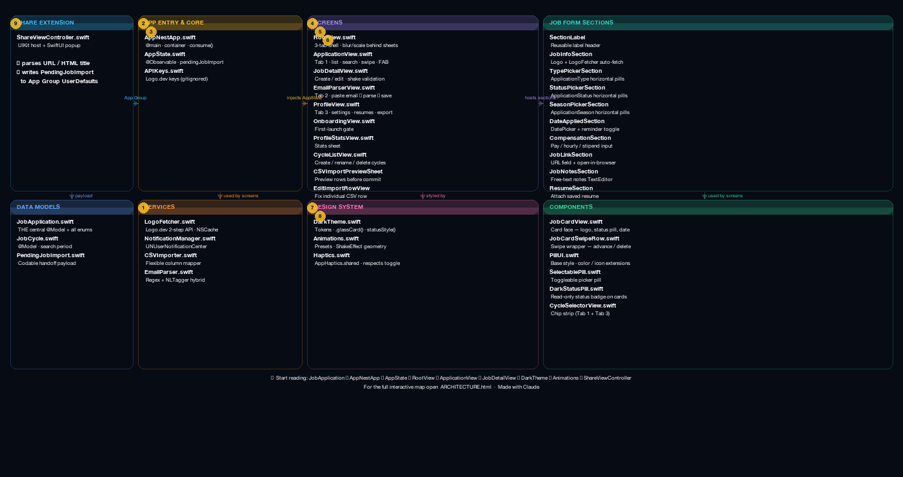

# App Nest

An iOS app for tracking job and internship applications, built with SwiftUI.

---

## Screenshots

> _Add screenshots or GIFs here_

---

## Features

### Tracking
| | |
|---|---|
| **Applications** | Company, position, type, status, season, compensation, notes, resume attachment |
| **Swipe to advance** | Swipe right to move a card through the pipeline; swipe left to delete with undo |
| **Cycles** | Group applications by search period (e.g. "Summer 2026", "Full-Time 2027") |
| **Bulk actions** | Edit Mode for mass delete or move-to-cycle |

### Import
| | |
|---|---|
| **Share Extension** | Share any job URL from Safari — auto-parses company, position, job type, and season |
| **CSV Import** | Flexible mapper handles any column naming; preview and edit before committing |
| **Email parsing** | Paste a confirmation email — on-device AI extracts company, position, and status |

### Discovery
| | |
|---|---|
| **Search** | Full-text across company and position, live as you type |
| **Filter & sort** | Filter by status chips; sort by date or company name |
| **Company logos** | Auto-fetched from Logo.dev, cached to the database, or upload your own |
| **CSV Export** | Export your list or active cycle to a standard CSV |

---

## Tech Stack

| Layer | Technology |
|---|---|
| UI | SwiftUI |
| Persistence | SwiftData (SQLite) |
| NLP / Parsing | Apple NaturalLanguage (NLTagger) + Regex + NSDataDetector |
| Logo Lookup | Logo.dev API |
| Architecture | Modern SwiftData MVVM (Direct @Query) |
| Design System | Custom Dark Theme + Emil-motion principles |

---

## Architecture

AppNest uses **SwiftData** as its persistence layer. Views query the database directly using `@Query`, eliminating the need for boilerplate ViewModel classes. Data updates are reactive and instantaneous across all views.

```
AppNest/
├── Core/                 # Entry point, AppState, and API Config
├── Design System/        # Theme (Glassmorphism), Motion, and Haptics
├── Models/               # SwiftData @Models (JobApplication, JobCycle, Resume)
├── Views/
│   ├── Screens/          # Main application screens (Application, Profile, etc.)
│   └── Components/       # Atomic UI elements (Pills, Cards, Modular Form Sections)
└── Assets.xcassets       # Static assets, branding, and color tokens

AppNestShare/
└── ShareViewController.swift  # Self-contained share extension (UIKit host + SwiftUI popup)
```

---

## Architecture Map

> For the full interactive visual map, open **`ARCHITECTURE.html`** in a browser (gitignored, lives locally). It shows all 44 files as a colour-coded, force-directed graph — hover for descriptions, click to inspect, toggle layers, enable reading-order badges.



```
AppNest/
├── Core/
│   ├── AppNestApp.swift          @main · SwiftData container · share extension bridge
│   ├── AppState.swift            @Observable · selectedCycleID · pendingJobImport
│   └── APIKeys.swift             Logo.dev keys (gitignored — never commit)
│
├── Models/
│   ├── JobApplication.swift      THE central file — @Model + all enums (read first)
│   ├── JobCycle.swift            @Model · named search period · nullify delete rule
│   ├── PendingJobImport.swift    Codable handoff payload from share extension
│   ├── LogoFetcher.swift         Logo.dev two-step API · NSCache
│   ├── NotificationManager.swift UNUserNotificationCenter helper
│   ├── CSVImporter.swift         Flexible CSV column mapper
│   └── EmailParser.swift         Regex + NLTagger hybrid · highlight spans
│
├── Design System/
│   ├── Theme/DarkTheme.swift     Tokens · .glassCard() · statusStyle(for:)
│   ├── Motion/Animations.swift   Named presets (.appSmooth etc.) · ShakeEffect
│   └── Haptics/Haptics.swift     AppHaptics.shared · respects user toggle
│
├── Views/
│   ├── Screens/
│   │   ├── RootView.swift            3-tab shell · blur/scale behind sheets
│   │   ├── ApplicationView.swift     Tab 1 · list · search · swipe · FAB · CSV
│   │   ├── JobDetailView.swift       Create / edit · shake validation · 10 sections
│   │   ├── EmailParserView.swift     Tab 2 · paste email → parse → save
│   │   ├── ProfileView.swift         Tab 3 · settings · resumes · stats · export
│   │   ├── OnboardingView.swift      First-launch gate
│   │   ├── ProfileStatsView.swift    Stats sheet
│   │   ├── CycleListView.swift       Create / rename / delete cycles
│   │   └── Import/
│   │       ├── CSVImportPreviewSheet.swift   Preview + validate rows before commit
│   │       ├── EditImportRowView.swift       Fix individual row
│   │       └── ImportSupport.swift           Column normalisation utilities
│   │
│   └── Components/
│       ├── Cards/
│       │   ├── JobCardView.swift       Card face (logo · name · status pill · date)
│       │   └── JobCardSwipeRow.swift   Swipe wrapper (advance pipeline / delete)
│       ├── Pills/
│       │   ├── PillUI.swift            Base style · enum color/icon extensions
│       │   ├── SelectablePill.swift    Toggleable picker pill
│       │   └── DarkStatusPill.swift    Read-only status badge on cards
│       ├── JobDetail/                  One file per form section in JobDetailView
│       │   ├── SectionLabel.swift
│       │   ├── JobInfoSection.swift    Logo + LogoFetcher auto-fetch
│       │   ├── TypePickerSection.swift
│       │   ├── StatusPickerSection.swift
│       │   ├── SeasonPickerSection.swift
│       │   ├── DateAppliedSection.swift    DatePicker + NotificationManager
│       │   ├── CompensationSection.swift
│       │   ├── JobLinkSection.swift
│       │   ├── JobNotesSection.swift
│       │   ├── ResumeSection.swift
│       │   └── InterviewKitSection.swift
│       └── CycleSelectorView.swift     Shared chip strip (Tab 1 + Tab 3)
│
└── Assets.xcassets

AppNestShare/
└── ShareViewController.swift     Self-contained ~1000 lines · UIKit host + SwiftUI popup
```

**Share extension flow:** Safari share → `ShareViewController` parses URL/title → writes `PendingJobImport` JSON to App Group UserDefaults → on next foreground `AppNestApp.consume()` → sets `appState.pendingJobImport` → `ApplicationView.onChange` inserts `JobApplication` into SwiftData.

**Reading order:** `JobApplication.swift` → `AppNestApp.swift` → `AppState.swift` → `RootView.swift` → `ApplicationView.swift` → `JobDetailView.swift` → `DarkTheme.swift` → `Animations.swift` → `ShareViewController.swift`.

---

## Getting Started

### Requirements

- macOS with Xcode 16+ installed (iOS 17.0+ SDK)
- A [Logo.dev](https://logo.dev) account for automatic company logo fetching (free tier works)

### Setup

1. Clone the repo
2. Create `AppNest/Core/APIKeys.swift` from the example file:
   ```swift
   enum APIKeys {
       static let logoDevPublicKey  = "pk_YOUR_PUBLISHABLE_KEY_HERE"
       static let logoDevSecretKey  = "sk_YOUR_SECRET_KEY_HERE"
   }
   ```
   Logo.dev uses two separate keys — both are in your Logo.dev dashboard. `APIKeys.swift` is gitignored and should never be committed.
3. Open `AppNest.xcodeproj` and run on an iOS 17+ simulator

---

## License

MIT License — Copyright (c) 2026 Mark Anjoul.
